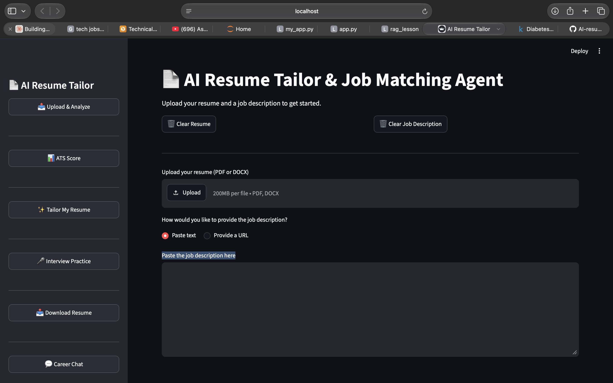

![AI Resume Tailor App Preview]
# 📄 AI Resume Tailor & Job Matching Agent


## 🚀 Live Demo

👉 **[Try the app here](https://your-app-name.streamlit.app)**

*(Note: the app may take a moment to wake up if it hasn't been used recently — Streamlit Cloud's free tier puts inactive apps to sleep.)*

An AI-powered application that analyzes how well a resume matches a job description, tailors resume content to a specific role, generates practice interview questions, and produces a downloadable tailored resume — all built around one core principle: **AI drafts, the human decides.** Every AI-generated piece of content is fact-checked against the candidate's real data and clearly labeled, never silently trusted.

---

## 🌟 What This App Does

Upload a resume (PDF or DOCX) and a job description (pasted text or a URL), and the app will:

1. **Score the match** — a six-component ATS-style score (Keyword, Skills, Experience, Education, Responsibilities, Formatting), each individually calibrated and explained.
2. **Tailor the resume** — rewrite the summary, reorder skills by relevance, and rewrite experience bullets — with every generated claim automatically fact-checked against the real resume data.
3. **Generate interview practice** — multiple-choice technical/role questions (graded) and open-ended behavioral/CV-based questions (with AI coaching feedback).
4. **Produce a downloadable document** — a real `.docx` resume combining tailored and real content, gated behind an explicit user acknowledgment of AI limitations.
5. **Offer a career chat** — a free-form conversational assistant grounded in the candidate's real analyzed data.

---

## ⚠️ Design Philosophy: Honest AI, Not Perfect AI

This project does not pretend AI-generated content is guaranteed accurate. During development, real fabrication cases were found and documented — an AI-generated resume bullet once added a fabricated detail ("cost reduction achieved through rightsizing") that wasn't in the source data; an interview question once stated a fabricated "34% cost reduction" as fact. The verification system built into this app **catches many, but not all, of these cases** — and the UI is explicit about that limitation everywhere AI content is shown, rather than implying false confidence.

---

## 🏗️ Architecture
Upload (PDF/DOCX/URL) → Extraction → CV/JD Analysis → Matching Engine → ATS Score
↓
Tailoring (+ verification) → Document Generation
↓
Interview Generator (+ verification) → Practice Quiz
↓
Career Chat (grounded in real data)


---

## 🛠️ Technology Stack

| Technology | Purpose |
|---|---|
| Streamlit | Web application framework and UI |
| Groq API | LLM inference (structured extraction, tailoring, chat) |
| PyMuPDF | PDF text extraction |
| python-docx | DOCX text extraction and document generation |
| Sentence Transformers | Embeddings for semantic similarity (`all-MiniLM-L6-v2`) |
| scikit-learn | Cosine similarity computation |
| Plotly | ATS score visualization |
| BeautifulSoup4 + Requests | Job description URL fetching |
| python-dotenv | Environment variable / API key management |

---

## 📁 Project Structure

| Path | Purpose |
|---|---|
| `my_app.py` | Streamlit entry point — all six UI pages |
| `pipeline_runner.py` | Orchestrator — ties extraction → analysis → scoring into one function |
| `extraction/` | Turns raw files/URLs into clean text |
| `Ai_analyser/` | LLM-based structured extraction of CV and JD content |
| `matching/` | Exact, semantic, and keyword comparison logic |
| `scoring/` | Experience, education, formatting scoring + the combined ATS formula |
| `tailoring/` | Resume content rewriting + fabrication verification |
| `interview/` | Interview question generation, verification, and answer coaching |
| `generation/` | Final `.docx` resume assembly |
| `chat/` | Conversational career chat backend |

---

## 🔍 Module Reference

### `extraction/`

| File | Function | Purpose |
|---|---|---|
| `pdf_reader.py` | `extract_text_from_pdf()` | Raw text extraction from PDF via PyMuPDF |
| `docx_reader.py` | `extract_text_from_docx()` | Raw text extraction from DOCX via python-docx |
| `text_cleaner.py` | `fix_hyphenation()` | Repairs words broken across PDF line-wraps (e.g. `Mathemat-` + newline + `ics` becomes `Mathematics`) |
| `url_reader.py` | `extract_text_from_url()` | Best-effort job description fetch from a URL; fails gracefully with a clear message on blocked sites |
| `pipeline.py` | `process_resume()` | Router: detects PDF vs DOCX, extracts, cleans, returns text |

### `Ai_analyser/`

| File | Function | Purpose |
|---|---|---|
| `cv_analyzer.py` | `analyze_cv()` | Extracts structured JSON from resume text: skills, experience, education, certifications, years of experience, education level, key duties. Uses a 4-model fallback chain. |
| `jd_analyzer.py` | `analyze_jd()` | Extracts structured JSON from job description text: required/preferred skills, responsibilities, qualifications, keywords, years required, education required, key responsibilities. |

### `matching/`

| File | Function | Purpose |
|---|---|---|
| `exact_matcher.py` | `exact_skill_match()` | Literal (normalized) overlap between CV and JD skill lists |
| `semantic_matcher.py` | `semantic_skill_match()`, `semantic_similarity()` | Embedding-based cosine similarity matching, with tunable thresholds calibrated per use case (0.5 for skills, 0.4 for responsibilities) |
| `keyword_matcher.py` | `keyword_match()` | Substring scan of raw CV text against JD keywords, simulating real-world ATS behavior |

### `scoring/`

| File | Function | Purpose |
|---|---|---|
| `experience_matcher.py` | `experience_match()` | Compares years of experience; returns a neutral score when the CV states no dates, rather than guessing |
| `education_matcher.py` | `education_match()` | Ranked degree-level comparison (none/bachelor/master/phd) |
| `formatting_checker.py` | `check_formatting()` | Checks contact info presence, section headers, and resume length |
| `ats_score.py` | `calculate_ats_score()` | Combines all six components into one weighted score (Keyword 30% / Skills 25% / Experience 20% / Education 10% / Responsibilities 10% / Formatting 5%) |

### `tailoring/`

| File | Function | Purpose |
|---|---|---|
| `tailor.py` | `tailor_summary()` | Rewrites the professional summary, constrained to only rephrase real data |
| `tailor_experience.py` | `tailor_experience()` | Rewrites experience bullets from real key duties |
| `tailor_skills.py` | `tailor_skills()` | Reorders (never invents/removes) the real skills list by JD relevance |
| `verify.py` | `verify_summary()`, `verify_skills_reorder()` | LLM-based fact-checker for generated text; deterministic set-comparison for skill reordering |
| `tailor_pipeline.py` | `generate_verified_summary()` | Combined generate + verify — the only safe entry point for summary tailoring |

### `interview/`

| File | Function | Purpose |
|---|---|---|
| `question_generator.py` | `generate_interview_questions()` | Generates technical/role-specific (MCQ) and behavioral/CV-based (open-ended) questions |
| `answer_reviewer.py` | `review_answer()` | Gives coaching feedback on the user's own typed answers |
| `interview_pipeline.py` | `generate_verified_questions()` | Combined generation + verification of the open-ended question categories |

### `generation/`

| File | Function | Purpose |
|---|---|---|
| `docx_builder.py` | `build_tailored_resume()` | Assembles a real `.docx` file from tailored + real (unedited) CV data |

### `chat/`

| File | Function | Purpose |
|---|---|---|
| `career_chat.py` | `get_chat_response()` | Conversational career assistant, grounded in real analyzed CV/JD data when available |

---

## 📦 Installation

**1. Clone the repository**

```bash
git clone https://github.com/onyeiwu/AI-resume-tailor.git
cd AI-resume-tailor
```

**2. Install dependencies**

```bash
pip install -r requirements.txt
```

**3. Create a `.env` file** in the project root: GROQ_API_KEY=your_groq_api_key_here


**4. Run the app**

```bash
streamlit run my_app.py
```

---

## 🔑 Getting a Free Groq API Key

1. Go to https://console.groq.com
2. Create a free account
3. Click **API Keys** in the sidebar
4. Click **Create API Key**
5. Copy the key into your `.env` file

---

## 🤖 AI Models Used

Every LLM call in this app uses a 4-model fallback chain — if one model fails or is rate-limited, it automatically tries the next:

| Model | Provider |
|---|---|
| openai/gpt-oss-20b | Groq |
| openai/gpt-oss-120b | Groq |
| groq/compound-mini | Groq |
| qwen/qwen3.6-27b | Groq |

---

## ☁️ Deploying on Streamlit Cloud

This app can run locally with a `.env` file, or on Streamlit Cloud using its built-in Secrets manager instead. The code checks `st.secrets` first and falls back to `.env` automatically, so no code changes are needed between environments.

To deploy:

1. Push this repository to GitHub.
2. Go to https://share.streamlit.io and sign in with GitHub.
3. Click **New app**, select this repository and branch, and set the main file path to `my_app.py`.
4. Under **Advanced settings → Secrets**, add: GROQ_API_KEY = "your_actual_key_here"


5. Deploy. Streamlit Cloud will provide a live URL once the build finishes.

---

## ⚠️ Known Limitations

- **PDF export is not yet supported** — only `.docx` output exists currently.
- **Live web search for job postings is not implemented.** The career chat is explicit about this when asked.
- **URL-based JD fetching works on some sites and is blocked on others** (e.g. Indeed actively blocks automated requests). Manual paste is the reliable fallback.
- **LLM extraction fields can vary slightly between runs** (e.g. years of experience, education-requirement interpretation) due to inherent model non-determinism. Components handle missing/uncertain data with explicit neutral scores rather than guessing.
- **Fabrication verification is not exhaustive.** It has been observed to both catch and miss real fabricated details across testing. The UI always displays original data alongside generated content for this reason.

---

## 🗺️ Roadmap

- [ ] PDF export
- [ ] Live web search integration for real job postings
- [ ] Batch mode — one CV against multiple job descriptions
- [ ] Automated test suite

---

## 👨‍💻 Author

**Onyeiwu Gabriel Chibuzor**
Built as a personal/portfolio project — end-to-end AI system design, LLM reliability engineering, and full-stack Streamlit development.

---

## 📜 License

This project is for educational and portfolio purposes.
All rights reserved 2026 Onyeiwu Gabriel Chibuzor.
